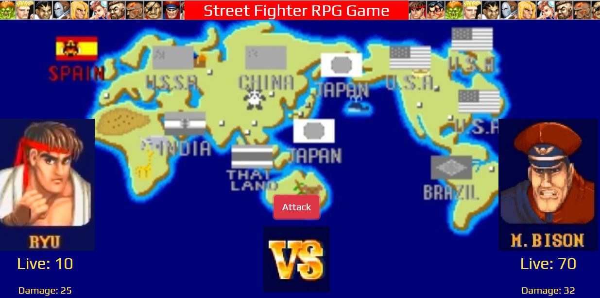

# Street Fighter RPG Game

## Overview 

* When the game starts, the player will choose a character by clicking on the fighter's picture. The player will fight as that character for the rest of the game.
* The player must then defeat all of the remaining fighters.
* The player chooses an opponent by clicking on an enemy's picture.
* Once the player selects an opponent, that enemy is moved to a defender area.
* The player will now be able to click the attack button.
* Whenever the player clicks attack, their character damages the defender. The opponent will lose health points. These points are displayed at the bottom of the defender's picture. 
* The opponent character will instantly counter the attack. When that happens, the player's character will lose some of their HP. These points are shown at the bottom of the player character's picture.

  

## Technologies used to develop the app
- HTML5
- CSS3
- Bootstrap
- Javascript
- JQuery

## App Link
https://jfsilvah.github.io/RPG-Game/index.html

## Author
ISC Francisco Silva
